**
软件需求规格说明书
**

# **
白雪公主与七个爷爷
** 

**文档修改记录**

|版本 |  日期 |  修改页 |  作者 |  批准人|
| - | - | - | - | - |
| 1.0 | 2020年6月9日 | all | 曾扬威 | 肖璐瑶、胡靓 |

# 目录

**白雪公主与七个爷爷** 0

[**一、 引言** 4](\l)

[**1.1编写目的** 4](\l)

[**1.2项目背景** 5](\l)

[**1.3参考资料** 5](\l)

[**二、 总体描述** 5](\l)

[**2.1 目标** 5](\l)

[**2.1.1 开发意图** 5](\l)

[**2.1.2 应用目标和作用范围** 6](\l)

[**2.1.3 产品前景** 6](\l)

[**2.2 用户场景** 6](\l)

[**场景 1：自我约束** 6](\l)

[**场景 2：规划计划** 7](\l)

[**场景 3：打卡** 7](\l)

[**三、具体需求** 7](\l)

[**3.1 类图** 7](\l)

[**3.2 属性** 8](\l)

[**3.2.1 可用性** 9](\l)

[**3.2.2 可维护性** 9](\l)

[**3.2.3 安全性** 9](\l)

[**3.3 外部接口需求** 9](\l)

[**3.3.1 用户接口** 9](\l)

[**3.3.2 硬件接口** 9](\l)

[**3.3.3 软件接口** 9](\l)

[**3.2.4 通信接口** 9](\l)

[**四、界面原型** 9](\l)

[4.1登录注册界面 9](\l)

[4.1.1登录 10](\l)

[4.1.2注册 13](\l)

[4.2 ToDoList 15](\l)

[4.2.1主页 15](\l)

[4.2.2添加代办 17](\l)

[4.2.3任务详情 18](\l)

[4.3 番茄时钟 21](\l)

[4.3.1开始计时 21](\l)

[4.3.2暂停选择操作 23](\l)

[4.4 日历 27](\l)

[4.4.1主页 27](\l)

[4.4.3日期的点击 29](\l)

[4.5 打卡 30](\l)

[4.5.1主页 30](\l)

[4.5.2打卡界面 31](\l)

[4.5.3自定义打卡 32](\l)

[4.6 个人中心 34](\l)

[4.6.1主页 34](\l)

[4.6.2设置个人信息 35](\l)

[4.6.3声音与提醒 36](\l)

[**五、功能描述和验证验收标准** 39](\l)

[**5.1 具体功能描述** 39](\l)

[**5.1.1 用例图** 39](\l)

[**5.1.2 工作流程图** 40](\l)

[**5.1.3 功能概述** 41](\l)

[**5.2 界面验收标准** 43](\l)

# **一、引言**

## **1.1编写目的**

介绍了本次团队开发项目的整体设计，包括项目需求总体描述、架构设计、软件原型，功能描述。

对于验收作业的老师助教以及其它同学，本说明书是一份项目开发的报告。

对于组内开发人员，本说明书是开发项目的根据。

对于用户，本说明书是软件的使用手册。

## **1.2项目背景**

软件名称：番茄List

项目任务提出者：2020春 计算机3,4班 彭琛老师

项目开发者：白雪公主与七个爷爷

## **1.3参考资料**

计算机软件需求规格说明书（GB/T 9385-2008）

# **二、总体描述**

## **2.1 目标**

### **2.1.1 开发意图**

随着我们生活水平的提高，人们对于养成良好生活习惯和制定日常计划的需求越来越多，然而自己在生活中却总是会因为拖延症和健忘，让自己的生活过得很不规律，即影响了自己第二天的工作和学习，又影响了自己的健康。再加上疫情的原因，导致我们只能在家中上课，但是很多同学在家里学习感觉会很难，总会受到许多干扰，于是我们想出设计一个帮助大家在家里自主学习的软件程序。

### **2.1.2 应用目标和作用范围**

我们的平台主要是在移动端。

面向于各种学生，其上课或者自主学习的时候，都可以使用我们的软件来保证学习效率，养成好的学习习惯。番茄List 学习系统，通过打卡的方式，提醒用户在规定的时间内完成自己设置的习惯，同时还可以写TODO List，记下当日的代办事项，还有番茄钟、自习室等功能，致力于培养用户养成一个个好的习惯，改掉生活中的拖延症，让每天的生活更加规律更加健康，事情能够更加有条不紊地进行。

### **2.1.3 产品前景**

我们的产品主要为想要自主学习的学生——目标明确

通过自习室认识更多和自己坚持同一个目标的人；在todolist中对自己的学习进行规划安排；使用番茄钟进行时间分配——功能齐全

我们身为在校大学生，也面临着很多考试，身边也有不少同学需要这样的软件来约束自己，对用户需求有更深层的认识——了解用户需求

不会将用户的信息透露给别的平台——信息安全

## **2.2 用户场景**

### **场景 1：自我约束**

典型用户：肖同学

用户需求：写数学自测卷

场景描述：

在考研前的暑假，肖同学想写一份数学自测卷来检测自己的水平，这位同学昨天也是这么想的，但由于在想要开始学习的时候看了一眼手机，自己最喜欢的小说又推送了新的内容，于是忍不住点开小说，发现小说更新了新的章节，开始看了起来，一不小心她才发现自己已经看了2个小时，荒废了2个小时的学习时间，打破了原来的计划。想到这，肖同学后悔不已，这时她看到了自己下载的番茄List，她果断的点开了番茄List，自此小说再也没有推送新的内容了。

### **场景 2：规划计划**

典型用户：周同学

用户需求：合理的安排自己生活与学习

场景描述：

周同学发现因为每天都坐在电脑面前自己的身体一日不如一日，但是她一旦学习起来就会忘记了其他的事情，于是她点开了番茄List，在TodoList中合理的规划了自己每天的学习时间与锻炼时间，每完成一项就能清晰的看到自己所完成的项目，学习到一定的时间，她就会出去锻炼。自此周同学不仅身体越来越好，学习的效率也越来越高了。

### **场景 3：打卡**

典型用户：曾同学

用户需求：早睡早起

场景描述：

曾同学每次打游戏都打到很晚睡觉，第二天总是又很晚起床，一睡就会睡到中午，但是最近他想要改变自己，不能再这样下去，想要养成良好的作息时间，于是他每天都打开番茄List，里面有专门的打卡专栏，每天进行打卡，同时还能看自己坚持了多久，一天一天的下去他越来越有成就感的同时作息时间也被改了过来。

# **三、具体需求**

## **3.1 类图**

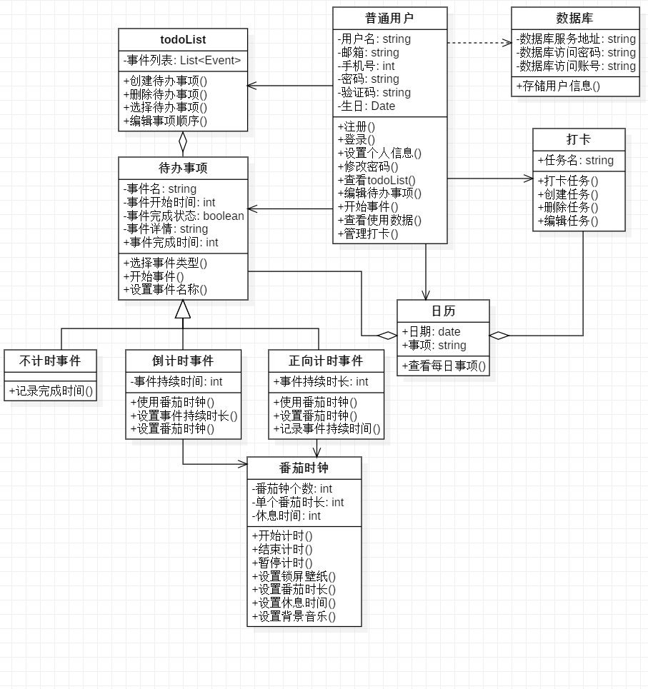

## **3.2 属性**

### **3.2.1 可用性**

本系统是人机交互的系统，要求系统在操作上方便简单，并且人性化，并力求达到界面上的美观，避免和以往那些死板的类似软件雷同，因为所设计的软件主要面对年轻人，青少年，所以需要在用户界面上注入一些活力，符合当代年轻人的审美观。

### **3.2.2 可维护性**

系统的基本维护必须简单，不要求需专业技术人员进行维护，通过一般的技术维护人员操作系统的维护功能，既可达到基本的维护目的，例如：数据备份、恢复、数据导入/导出等维护操作。

### **3.2.3 安全性**

系统面对访问系统的用户分权限管理，系统管理员拥有对系统所有的权限，用户只能进行特定的功能的操作，防止未授权用户的非法登陆，并对用户对系统的操作做好记录，有利于在发现系统故障时快速查找原因。

## **3.3 外部接口需求**

### **3.3.1 用户接口**

本系统采用C/S架构，所有界面使用APP风格，用户界面的具体细在功能需求文档中描述。

### **3.3.2 硬件接口**

无特殊需求。

### **3.3.3 软件接口**

无特殊需求。

### **3.3.4 通信接口**

无特殊需求。

# **四、界面原型**

## **4.1登录注册界面**

### **4.1.1登录**

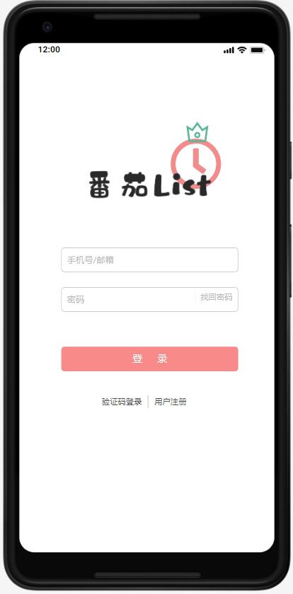

**点击进入番茄List APP，我们会先来到登录界面，输入手机号和密码，这时点击登录按钮进入功能界面。**

**如果您是第一次使用本产品，请点击注册按钮，进入注册界面进行注册。**

如果忘记了密码也可以点击找回密码进行更改新的密码，进行此操作时是需要验证码的验证的，保护了用户的安全，以免他人进行恶意的更改。

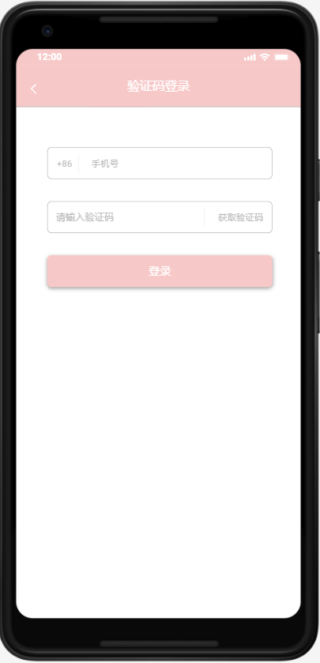

如果说不想那么麻烦使用账号密码登录的话，也可以使用手机验证码进行登录，这样的登录方式既简便又安全。

### **4.1.2注册**

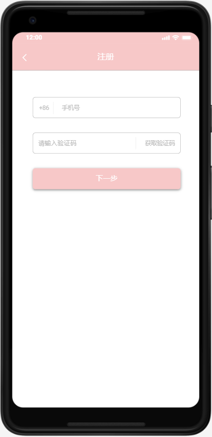

**进入注册页面，首先填写手机号，然后获取验证码，填写验证码后点击下一步进行初步的个人信息设置。**

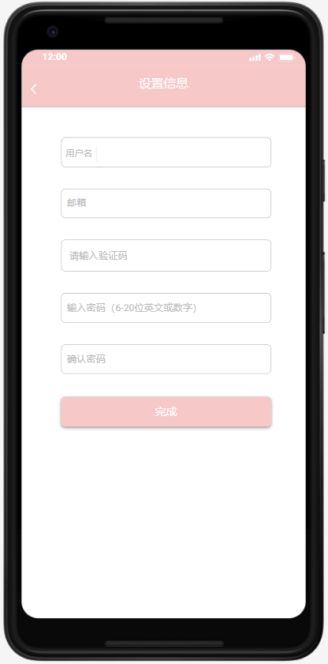

填写好最基础的信息，用户名、邮箱和密码以后，用户便可以注册成功，返回登录页面进行登录。

## **4.2 ToDoList**

### **4.2.1主页**

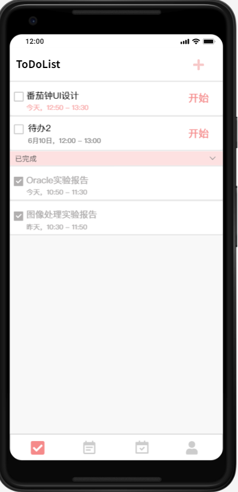

**进入主页后便可以看到ToDoList的界面，上面是待完成的项目，下面是已完成的项目，可以一目了然的看到自己所需要做的和已经做好的。**

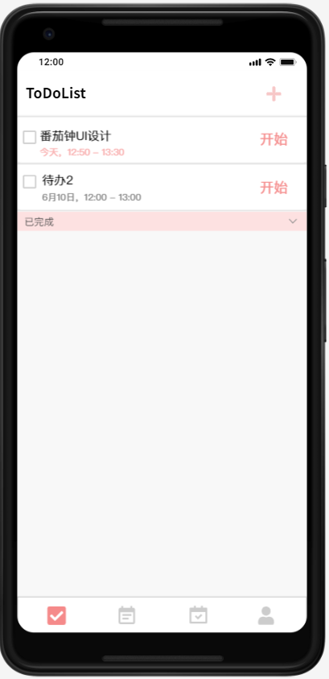

同时也可以点击粉色条烂右边的下三角箭头将已完成的清单进行隐藏，如果需要查看已完成的清单时可以再点开进行查看，这样使得界面能够更简洁，突出还未完成的清单。

### **4.2.2添加代办**

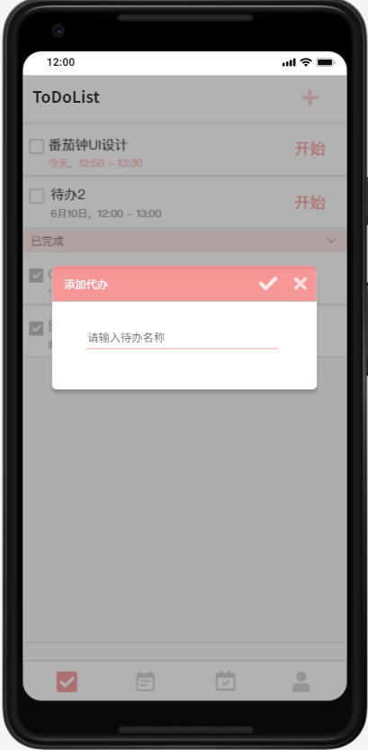

点击主页右上角的加号键便可以添加新的代办事项，随时随地想要需要做的事便可以随时添加，既简单又方便。

### **4.2.3任务详情**

点击事项便可以编辑或查看任务详情，如时间、描述、设置番茄钟等，同时如果需要也可以删除此任务。

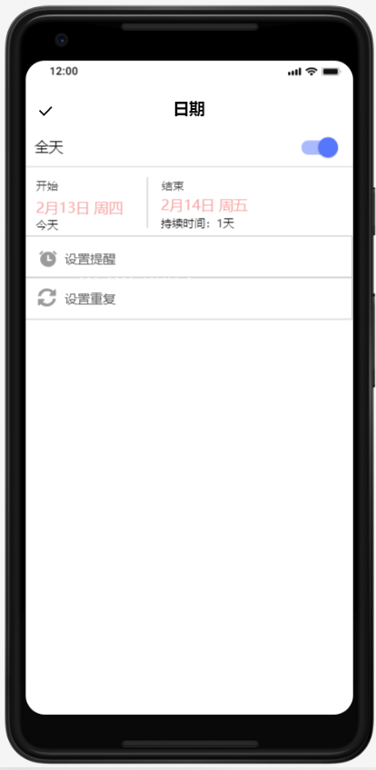

点击时间便可以对任务进行时间上的设定，可以调成全天也可以调成一段时间，同时可以设置提醒和重复，给用户提供更多的选择。

点击番茄钟设置便可以对任务的计时方式、番茄时长、休息时长进行自定义的设置。

## **4.3 番茄时钟**

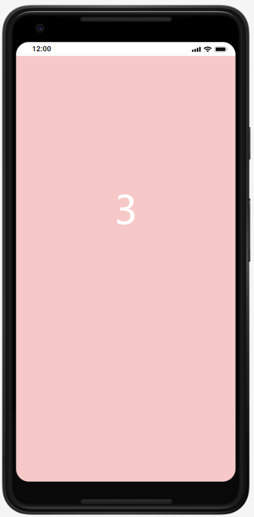

### **4.3.1开始计时**

**开始计时后会先进行3秒钟的倒计时，让用户能够提前做好进行该任务的准备，同时倒计时也可以让用户有一种很正式的感觉，这就会让用户认真的对待该任务。**

3秒倒计时过后，正式进入番茄钟的计时，这时用户便可以放下手机，开始专注于自己的事情，同时可以点击暂停键暂停计时。

### **4.3.2暂停选择操作**

用户可以进行暂停选择操作，选择放弃当前计时、终止本次计时、或者取消暂停选择的操作。

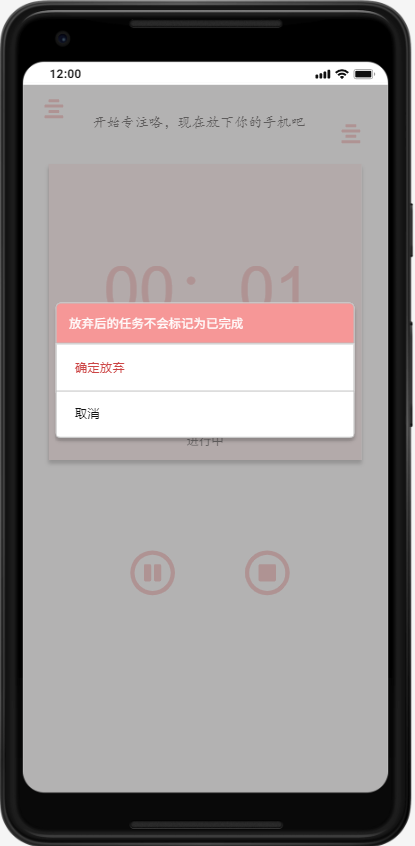

在点击放弃当前计时后会弹出再次确认放弃任务的对话框，给用户重新考虑是否放弃计时的机会，同时如果放弃任务，任务是不会标记为已完成的任务的。

在点击终止本次计时后，会进入休息的界面，这也意味着本次的任务已经结束，这是本次任务最后的休息时间。

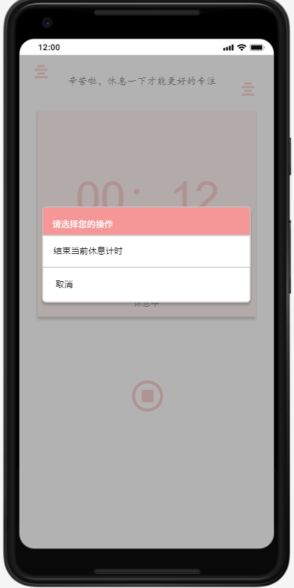

在点击结束当前休息后，用户便回到Todolist主页，然后就可以开始选择需要专注的下一个事件。

## **4.4 日历**

### **4.4.1主页**

点击日历后进入日历的主页，日历上会显示最基础的节日日期等，同时日历上也跟随ToDolist记录了待办的事件，时刻提醒自己未来需要完成的事件。

### **4.4.2年份与月份的选择**

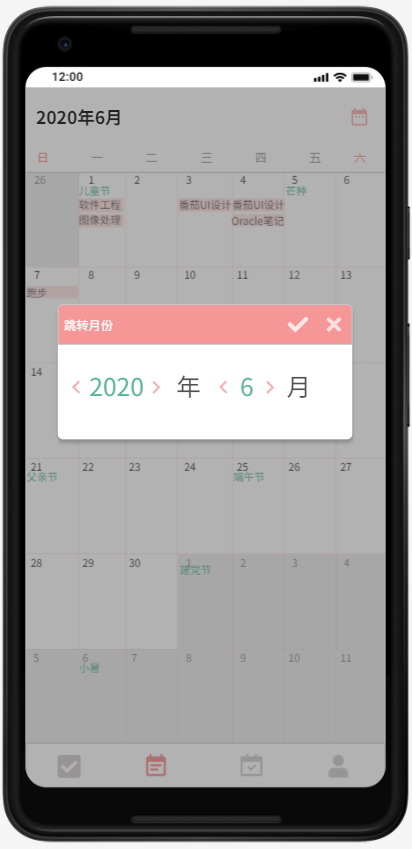

点击日历右上角的小图标便可以随时查看其他年月份的日历。

### **4.4.3日期的点击**

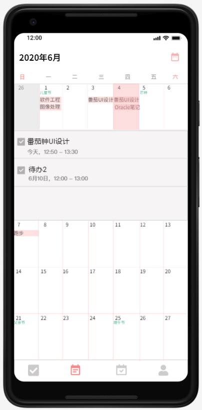

点击日期上的事件，便可以看到该日的事件，通过日历可以清晰的显示出来，这样能让用户对自己的日常计划能够更深刻的印象。

## **4.5 打卡**

### **4.5.1主页**

进入打卡页面，会展现日期和打卡的项目，同时会显示打卡项目所坚持的时间，设置了时限的打卡项目底下的背景颜色条会随着所坚持的时间而变长，这样就可以很明确的看到自己所坚持时间与完成还差多少，增加用户的成就感，使用户更有信心的完成以后的打卡。

### **4.5.2打卡界面**

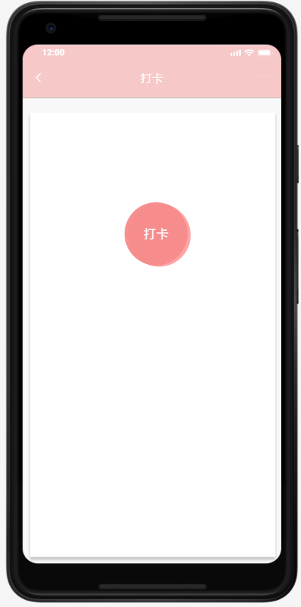

**点击打卡进入打卡的专属页面，让打卡也显得庄重与正式。**

### **4.5.3自定义打卡**

**用户可以自定义添加打卡的内容，让自己养成更多的好习惯。**

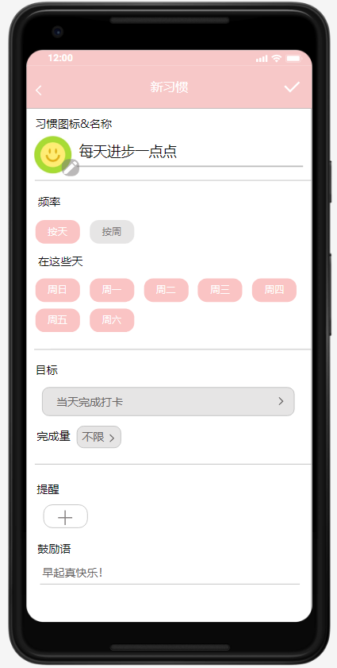

用户点击需要自定义的打卡内容可以设置打卡的更多内容，如习惯图标和名称，凸显出自己的个性，设置频率约束自己打卡的时间，给自己定一个小目标，如果害怕自己忘记可以增加提醒，同时可以设置鼓励语，让自己每一天都元气满满。

## **4.6 个人中心**

### **4.6.1主页**

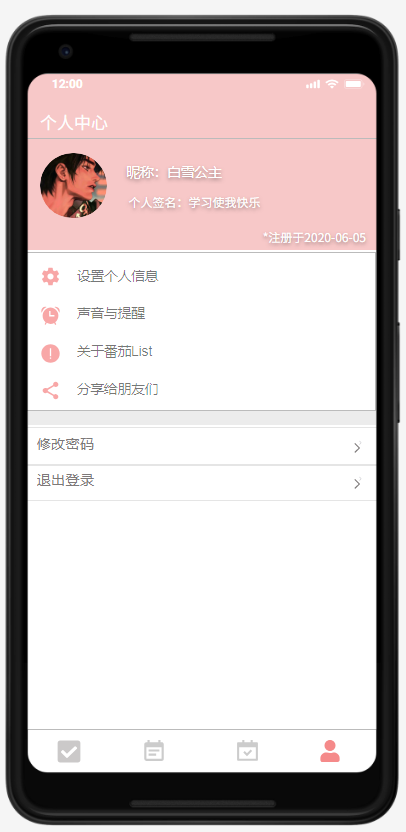

**点击个人中心进入个人中心的主页，在这里用户可以看到自己的昵称个人签名以及注册时间，同时在下面可以设置个人信息，声音与提醒，还有我们番茄List的相关，同时可以分享给朋友们，一起使用番茄List。**

### **4.6.2设置个人信息**

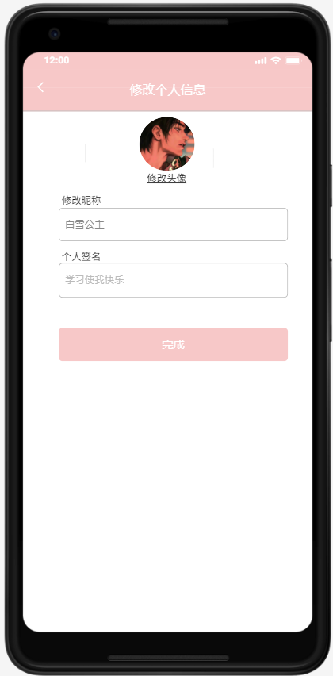

**在个人信息修改页面可以进行用户头像、昵称、个人签名的修改，彰显自己的魅力与个性。**

### **4.6.3声音与提醒**

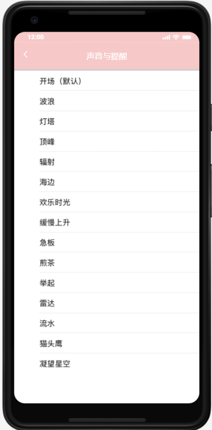

点击声音与提醒可以选择自己喜欢的提示音，让用户有更多的选择。

### **4.6.4修改密码**

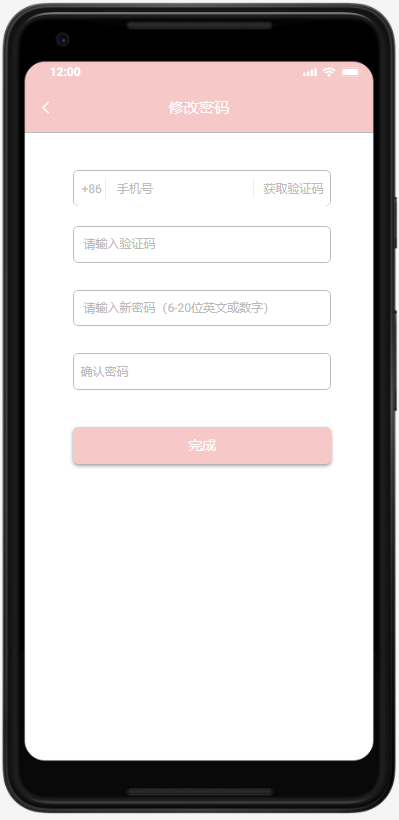

用户可以通过手机验证来修改自己的密码，防止他人恶意的修改。

### **4.6.5关于我们**

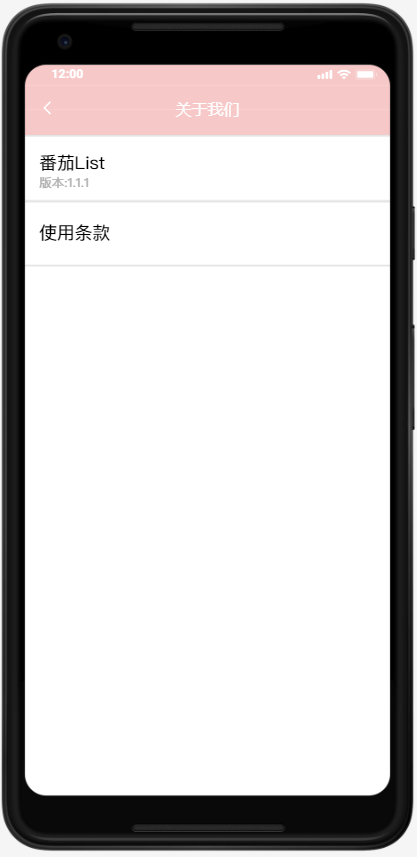

最后是关于我们番茄List的一些相关，在这里可以找到关于我们的一切，让用户更深刻的了解我们这款app和我们的开发团队。

# **五、功能描述和验证验收标准**

## **5.1 具体功能描述**

### **5.1.1 用例图**

### **5.1.2 工作流程图**

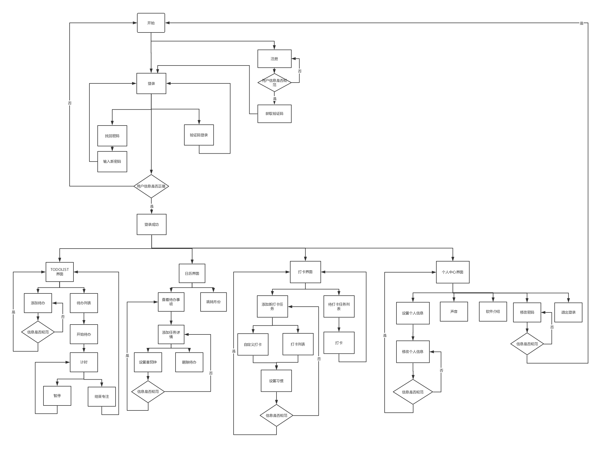

### **5.1.3 功能概述**

|**功能**| **概述**| **用户**|
| - | - | - |
|登录注册| 注册用户、登录账号| 全部|
|ToDoList 使用|对待办的增删改以及使用| 全部|
|番茄钟使用| 对待办事件的计时| 全部|
|每日打卡| 对专门的事件进行打卡，养成习惯| 全部|
|日历使用| 查看日历以及未来所需要处理的事件| 全部|
|声音和提醒音选择| 选择自己喜欢的提示音| 全部|
|账号修改| 修改个人资料| 全部|

（1）登录注册：

注册：

用户输入正确的手机号和身份信息，注册得到app使用账号。

登录：

用户输入正确账号密码，登录成功，跳转软件使用页面。

（2）ToDoList使用：

待办创建：

进入待办页面，点击创建加号，用户可以输入名称，创建待办事项。

待办开始：

点击待办事项的开始按钮，用户可以开始对应待办，跳转至时钟界面开始专注。

待办编辑，删除：

点击待办事项，用户输入描述待办信息，编辑待办的时间、番茄种设置，点击完成保存修改，点击删除删除待办。

已办隐藏：

点击箭头收起隐藏已办的事项。

（3）番茄钟使用：

番茄钟开始：

点击待办事件的开始，番茄钟开始计时。

暂停时钟：

点击暂停按钮暂停计时。

暂停选择操作：

点击终止按钮选择放弃当前计时或者终止本次计时进去休息计时。

（4）日历使用：

查看日历：

进入日历页面，可以查看日历信息，同时可以查看在日历上标识的待办。

更改日历年月：

点击小日历按钮修改需要查看的年月的日历。

查看日期详情：

点击日期可以查看改日的待办内容。

（5）每日打卡：

用户打卡：

点击需要打卡的事件，进去专属的打卡页面，同时记录所打卡的次数。

自定义打卡：

点击需要添加的打卡内容，在打卡内容里设置打卡的图标、名称、频率、提醒、鼓励语。

（6）声音和提示音选择：

选择用户自己喜欢的提示音

（7）账号修改：

修改信息：

进入个人信息页面，点击设置个人信息，修改用户的头像、昵称、个人签名。

修改密码：

点击修改密码，使用手机号验证码修改个人密码。

## **5.2 界面验收标准**

|**序号**|**界面名称**|**界面描述**|**备注**|
| - | - | - | - |
| 1 | 登录 | 番茄List logo，账号输入框，密码输入框，登录按钮，找回密码按钮，验证码登录选项，用户注册按钮。 |   |
|2|注册|点击用户注册就可以进入注册页面，页面有手机号输入框，验证码输入框，邮箱输入框，密码输入框，确认密码输入框以及完成按钮。左上角返回箭头，点击完成登录页面。||
|3|ToDoList|页面显示待办事件和已完成事件，粉色条栏将未办和已办隔离，同时已完成事件上有向下的箭头图标，点击即可隐藏或显示已完成事件。主页右上角加号进行新建待办项目，弹出对话框输入待办名称。点击待办显示任务详情，可输入任务描述，时间设置。点击右上角竖排的三个黑点显示设置番茄钟和删除，点击设置番茄钟弹出番茄钟设置界面，计时方式、番茄时长、休息时长、点击删除则删除该任务返回ToDoList主页面。|
|4|番茄钟|   进入番茄钟首先显示3.2.1倒计时，计时完毕进入番茄钟界面，正中心显示计时时间，计时下面有暂停和暂停选择按钮，点击按钮进行相应操作。当休息时将进入休息时间的计时，休息计时结束后返回ToDoList主页。||
|5|日历|  用户可以在该页面上查看日期信息，点击右上角小图标弹出跳转年月份对话框，点击对应的日期，弹出该日期的待办事件。||
|6|打卡|  显示打卡的内容，同时上面有日期显示。点击打卡进去打卡页面，打卡完成后返回打卡主页面。点击右上角加号进去自定义打卡界面，点击相应的打卡内容进入设置页面，显示多项设置，习惯图标和名称、频率选择按钮、目标选择框，提醒添加键，鼓励语输入框，点击右上角√完成添加，返回打卡主页。 ||
|7|个人中心| 用户可以在该页面上查看个人信息，头像、昵称、个人签名、注册时间。同时页面中有设置个人信息、声音与提醒、关于番茄List、分享给朋友们选项，下方则有修改密码和退出登录按钮。||
|8|设置个人信息|  页面中显示用户现头像，头像下方有修改头像按钮，修改昵称输入框，个人签名输入框，完成键按钮，点击完成，完成个人信息修改返回个人中心。||
|9|声音与提醒|    页面显示多种提示音，选择提示音后点击左上角返回键返回个人中心页面。||
|10|   关于番茄List| 页面中显示本番茄List的版本号和使用条款。||
